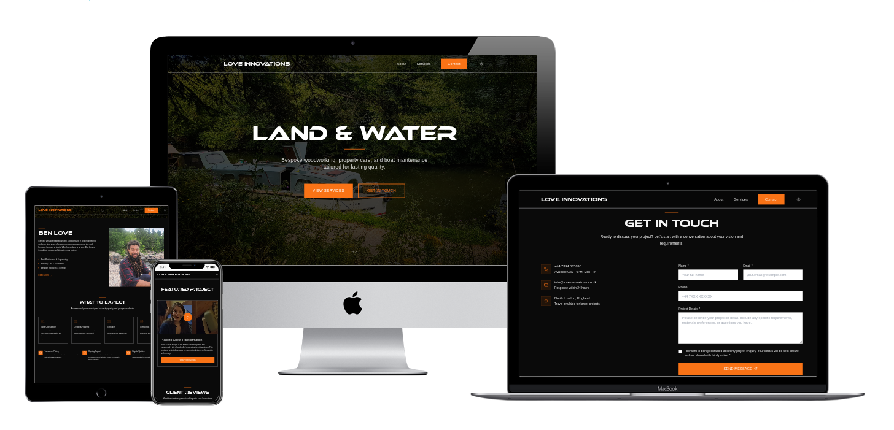

# Love Innovations Portfolio



A portfolio website for a multi-skilled engineer specializing in houseboat maintenance, property renovation, and custom woodworking. The site is designed as a static HTML/CSS/JS project with modular JavaScript components and Tailwind CSS.

## Live Preview

The site is now **live** at the custom domain, deployed via **Vercel** and connected through **IONOS**:

[https://www.love-innovations.com](https://www.love-innovations.com)

To deploy locally, follow the instructions below.

---

## Project Structure

```
.
├── index.html
├── marine-projects.html
├── property-projects.html
├── bespoke-projects.html
├── project-detail.html
├── privacy-policy.html
├── terms-of-service.html
├── styles/
│   └── globals.css
├── js/
│   ├── main.js
│   ├── home.js
│   ├── project-detail.js
│   ├── marine-projects.js
│   ├── property-projects.js
│   ├── bespoke-projects.js
│   ├── utils.js
│   ├── data/
│   │   └── projects.js
│   ├── components/
│   │   ├── About.js
│   │   ├── Contact.js
│   │   ├── Services.js
│   │   ├── Projects.js
│   │   ├── Testimonials.js
│   │   └── ImageWithFallback.js
│   └── shared/
│       ├── navigation.js
│       └── theme.js
├── fonts/
│   ├── Ethnocentric-Regular.woff
│   └── Ethnocentric-Italic.woff
├── images/
│   ├── 01_marine/
│   ├── 02_property/
│   ├── 03_bespoke/
│   └── profile.jpg, flight2.jpeg
└── README.md
```

---

## Tech Stack

- **HTML5** – Semantic structure and accessibility
- **Tailwind CSS** – Utility-first styling
- **JavaScript** – Vanilla JS with modular ES6 components
- **Formspree** – For secure contact form submissions
- **Lucide Icons** – Icon library for UI elements
- **Responsive Design** – Mobile-first and accessible layout

---

## Features

- Hero section with animations and CTA buttons
- An 'About' section with a popup modal for extra details
- A 'What to Expect' section with sequentially animated steps that highlight and change color one at a time
- Modular project listing per category: marine, property, bespoke. Each individual project has a description and an image gallery.
- Fullscreen media viewer for project images and video
- Dark/light mode toggle with persistent preference
- A featured project section with a video
- A 'Testimonials' section with stats underneath
- Contact form integrated with [Formspree](https://formspree.io/)
- Footer and Navigation accessible all pages
- Legal pages: Privacy & Terms
- Mobile reponsivity & navigation

---

## UI/UX Design

The design behind this project is clean, minimal, and modern with subtle interactive motion.

- **Branding & Visual Design**
  - Use of custom fonts: *Ethnocentric-Regular* and *Ethnocentric-Italic* for logo and headers
  - Body text fonts: *Nunito Sans* and *Open Sans* imported from Google Fonts for readability
  - Color palette illustrated below:
  
    .png)
  
  - Dark mode support with inverse color scheme for night reading comfort

## Future Improvements

- Add before/after slider feature
- SEO and meta tag optimization

---

## License

All images and video content are property of the business owner. Not for commercial redistribution.

---

## Getting Started

### 1. Clone the Repository

```bash
git clone https://github.com/aria-vero-s/love-innovations-portfolio.git
cd love-innovations-portfolio
```

### 2. Launch with Live Server

You can use the **Live Server** extension in VSCode or run a local server:

```bash
# With Python 3
python -m http.server
```

Then open `http://localhost:8000` in your browser.

---

## Credits

Developed by **Ariane Saulnier**  
Design, layout, and structure handcrafted for **Love Innovations** (Ben Love)

---
